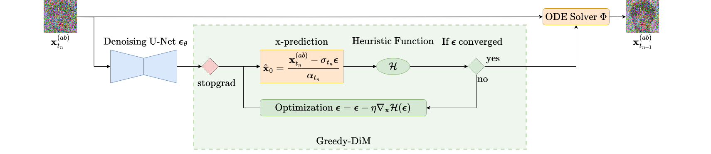

<div align="center">
<h1> Greedy-DiM (IJCB 2024) </h1>
<h3> Greedy-DiM: Greedy Algorithms for Unreasonably Effective Face Morphs </h3>

[Zander W. Blasingame](https://zblasingame.github.io/) &emsp; <b>&middot;</b> &emsp; [Chen Liu](https://camel.clarkson.edu/members.html)

Clarkson University

[](https://arxiv.org/abs/2404.06025)
[](https://ieeexplore.ieee.org/document/10744517)
[](https://zblasingame.github.io/Greedy-DiM/)
</div>

## News
- **2024.11.11**: Camera ready version is now available on IEEE Xplore!
- **2024.09.26**: We have released the main code. Configuration details for Greedy-DiM and past models (DiM and Fast-DiM) are found in `configs`
- **2024.09.17**: We presented our work in Buffalo, NY. Thanks to everyone who stopped by our posters and listened to our talk!
- **2024.07.16**: Congratulations on Greedy-DiM for being accepted by IJCB 2024! Our code base is under development, stay tuned for updates.

## Introduction

The official PyTorch implementation of [Greedy-DiM](https://arxiv.org/abs/2404.06025) (**IJCB 2024 Spotlight**), [DiM](https://ieeexplore.ieee.org/document/10381591) (**IEEE TBIOM and IJCB 2024 Oral**), and [Fast-DiM](https://ieeexplore.ieee.org/document/10569993) (**IEEE Security \& Privacy**).


Greedy-DiM is a *simple* yet **unreasonably effective** face morphing algorithm that far suprasses previous representation-based morphing algorithms and even beats landmark-based morphing algorithms.
With a simple greedy guided algorithm Greedy-DiM is able to significantly improve the effectiveness of DiM while still retaining the high-visual fidelity that is characteristic of DiM.
Moreover, we *prove* that the search space of the Greedy-DiM is well-posed and that it contains the **optimal** morphed face.
Experimental results show that Greedy-DiM is *currently* the strongest face morphing algorithm available, pushing the SOTA.


The heart of the Greedy-DiM* algorithm.


## Release Notes
This repository is an updated version of [DiM](https://github.com/zblasingame/DiM/), with several new features:

* Greedy guided generation for Diffusion Morphs (Greedy-DiM) (`Greedy-DiM*`, `Greedy-DiM-S`)
* Simplified codebase for switching between different DiM variants, i.e., DiM, Fast-DiM, and Greedy-DiM
* General optimization improvements: reduced memory usage, faster inference, &c.

## Supported Models
In addition to Greedy-DiM* we also support the following models:

| Model         | Description                       |
| :---------    | :------------                     |
| DiM           | The original DiM model, named DiM-A in Table 5 |
| Fast-DiM      | Uses second-order multistep ODE solver to solve the PF ODE to reduce NFE |
| Fast-DiM-ode  | Same as Fast-DiM plus an improved formulation to solve the PF ODE forwards in time, resulting in reduced NFE |
| Greedy-DiM-S  | Greedy-DiM with a greedy search strategy results in improved MMPMR and uses less memory |

with configurations files for these different models are found in the `configs` directory.
Their efficacy measured in MMPMR (Mated Morphed Presentation Match Rate) can be observed in Table 5 from our paper shown below.


## Code Release
In accordance with the our agreement with [CITeR](https://citer.clarkson.edu/) we have encrypted our morphing code.
To obtain access to it sign the [code release form](CITeR_SoftwareReleaseAgreeement.docx) and send it to [citer@clarkson.edu](mailto:citer@clarkson.edu?subject=[GitHub]%20DiM%20Source%20Code%20Request).
Upon approval the passphrase requested by the installer will be sent over.

## Installation
To install this repository first clone the repo using `git`.
Then run the provided installation script `install.sh`.
This script will setup the virtualenv and install all dependencies for the project.
Lastly, the installation script will ask for passphrase to decrypt `run_dim.py.gpg`, the passphrase can be obtained by filling out the [code release form](CITeR_SoftwareReleaseAgreeement.docx).

### Setting up external models
In this repository we make use of two pre-trained models from other projects.

1. The diffusion backbone used in this project is the Diffusion Autoencoder from the [diffae repository](https://github.com/phizaz/diffae).
Install the `ffhq256_autoenc/last.ckpt` checkpoint and place in the `checkpoints` directory.

2. The identity loss makes use of the ArcFace FR system. To download the same version we used in our experiments navigate to the [arcface repository](https://github.com/deepinsight/insightface/tree/master/recognition/arcface_torch) and download the `glint360k_cosface_r100_fp16_0.1` folder and place it in the `arcface` folder.

## Usage
First activate the virtual environment with
```
source venv/bin/activate
```

Then run morphing script `run_dim.py`, which takes the following arguments:
```
usage: run_dim.py [-h] [-b BATCH_SIZE] morph_list config

positional arguments:
  morph_list            A CSV file containing paths to morph pairs and output directory, an example line:
                        "source_dir/id_a.png,source_dir/id_b.png,output_dir/morph_a_b.png"
  config                YAML file containing configuration for the run

optional arguments:
  -h, --help            show this help message and exit
  -b BATCH_SIZE, --batch_size BATCH_SIZE
                        The batch size for processing.
```

The CSV describes the images to be morphed together and consists of rows in the following format
```csv
path/to/source/id_a.png,path/to/source/id_b.png,path/to/output/morph_a_b.png
path/to/source/id_c.png,path/to/source/id_d.png,path/to/output/morph_c_d.png
```
N.B., the morphing script expects the images to already be **aligned**. We used the dlib alignment process used to create [FFHQ](https://github.com/NVlabs/ffhq-dataset).

Additionally, the morphing script expects a configuration file which details the structure of the experiment. For example the Greedy-DiM* config file looks like
```yaml
# Configuration file for Greedy-DiM* algorithm. See Algorithm 1 in https://arxiv.org/abs/2404.06025
---
encoding_timesteps: 250
sampling_timesteps: 20
scheduler_kwargs:
  n_train_steps: 1000
  solver_order: 1
  prediction_type: epsilon
  algorithm_type: dpmsolver++
encoding_solver: diffae
greedy:
  type: opt
  kwargs:
    n_opt_steps: 50
    opt_stride: 1
    opt_kwargs:
      lr: 0.01
      betas: [0.5, 0.9]
loss_fn:
  type: zhang_identity_prior
  arcface_backbone: arcface/glint360k_cosface_r100_fp16_0.1/backbone.pth
```

We provide a configuration file for several DiM variants.

## Citation
If this work is helpful for your research, we ask that you consider citing the relevant papers:

```bibtex
@INPROCEEDINGS{blasingame_greedy_dim,
  author={Blasingame, Zander W. and Liu, Chen},
  booktitle={2024 IEEE International Joint Conference on Biometrics (IJCB)}, 
  title={Greedy-DiM: Greedy Algorithms for Unreasonably Effective Face Morphs}, 
  year={2024},
  volume={},
  number={},
  pages={1-11},
  keywords={Greedy algorithms;Schedules;Face recognition;Biological system modeling;Closed box;Generative adversarial networks;Diffusion models;Iterative methods;Optimization},
  doi={10.1109/IJCB62174.2024.10744517}}


@article{blasingame_dim,
   title={Leveraging Diffusion for Strong and High Quality Face Morphing Attacks},
   volume={6},
   ISSN={2637-6407},
   url={http://dx.doi.org/10.1109/TBIOM.2024.3349857},
   DOI={10.1109/tbiom.2024.3349857},
   number={1},
   journal={IEEE Transactions on Biometrics, Behavior, and Identity Science},
   publisher={Institute of Electrical and Electronics Engineers (IEEE)},
   author={Blasingame, Zander W. and Liu, Chen},
   year={2024},
   month=jan, pages={118–131}}

@article{blasingame_fast_dim,
   title={Fast-DiM: Towards Fast Diffusion Morphs},
   volume={22},
   ISSN={1558-4046},
   url={http://dx.doi.org/10.1109/MSEC.2024.3410112},
   DOI={10.1109/msec.2024.3410112},
   number={4},
   journal={IEEE Security &amp; Privacy},
   publisher={Institute of Electrical and Electronics Engineers (IEEE)},
   author={Blasingame, Zander W. and Liu, Chen},
   year={2024},
   month=jul, pages={103–114} }
```
